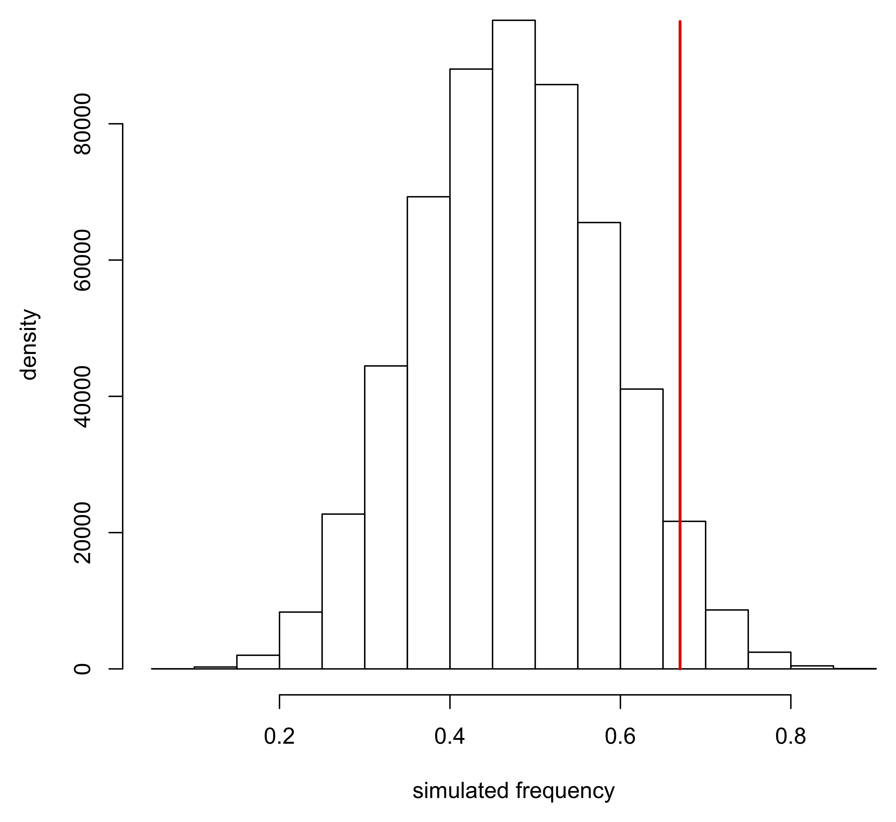

# frequency_diff

The R code presented here calculates a Monte Carlo probability that the observed frequency of an allele differs from another estimate.  These probabilities were reported in:

Ricaut F-X, T Thomas, M Mormina, MP Cox, M Bellati, RA Foley and M Mirazón Lahr. 2010. [Ancient Solomon Islands mtDNA: Assessing Holocene settlement and the impact of European contact](https://doi.org/10.1016/j.jas.2009.12.014). *Journal of Archaeological Science* 37: 1161-1170.

Ricaut FX, MP Cox, M Lacan, C Keyser, F Duranthon, B Ludes, J Guilaine and E Crubézy. 2012. [A time series of prehistoric mitochondrial DNA reveals western European genetic diversity was largely established by the Bronze age](https://doi.org/10.4236/aa.2012.21002). *Advances in Anthropology* 2: 14-23.

This [probability function](frequency_diff_probabilities.R) is written in base R, and requires vaues for the frequency and sample size of an observed allele in the study ('test') population, a baseline allele frequency to compare against (e.g., a published value or a value from a neighboring region), and the number of iterations to simulate. Random draws from a binomial are used to estimate the density function of frequencies consistent with the observed frequency of the allele in the study population, conditioned on its sample size.  The probability is inferred by where the baseline frequency falls within this simulated density.  An optional argument returns the simulated frequency distribution.

General usage:

frequency_diff(*iterations*, *baseline.frequency*, *test.frequency*, *test.samplesize*, *return.sims=FALSE*)

Worked example: 

Consider the B4a1a1 mitochondrial DNA allele.  The frequency has been reported as 0.670 in a neighboring geographical region.  In a new study, you observe a frequency of 8/17 (= 0.471).  To determine whether this new frequency differs from the published one, the R function would be called with 10,000 iterations as:

```
frequency_diff(10000, 0.670, 8/17, 17)
```

The example returns:

```
Confidence intervals:

95% CI
0.261 0.692 

99% CI
0.204 0.753 

99.9% CI
0.149 0.815 

Probabilities:

sims < baseline frequency
0.959 

sims ≤ baseline frequency
0.96 

sims = baseline frequency
0.000826 

sims ≥ baseline frequency
0.0408 

sims > baseline frequency
0.0399 
```

Allele B4a1a1 has an observed frequency of 0.471. Estimated 95% confidence intervals are 0.261–0.692.  Because only 4.1% of values in the density function were frequencies greater than or equal to the published frequency (0.670), the observed frequency is statistically significantly lower with probability P = 0.0408.

If desired, the density of simulated frequencies can be observed and analyzed using:

```
density <- frequency_diff(10000, 0.670, 8/17, 17, return.sims=TRUE)
hist(density, ylab="density", xlab="simulated frequency", main="")
lines(c(0.670,0.670), c(0,95000), lwd=2, col="red")
```
<p align="center">

</p>

Note that these densities are not (usually) normally distributed and become strongly asymmetrical as test frequencies approach the boundary conditions of 0 and 1.
